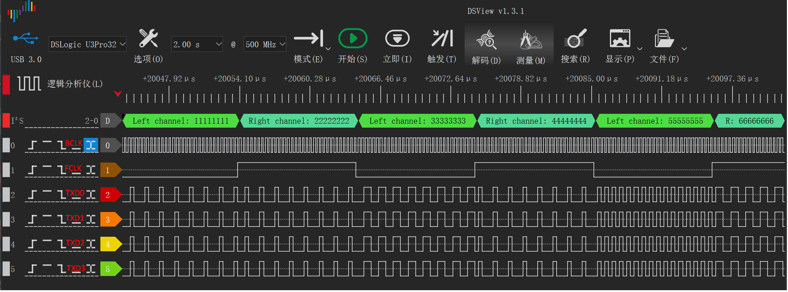

# I2S Multi-line DMA Transfer Example

## Overview

- This example project demonstrates the functionality of multi-line DMA transfer using the I2S interface

## Requirements and Limitations

- DMAv2 peripheral supports burst loop transfer functionality (e.g., HPM6E00 series)
- Since data is written sequentially to I2S->TXD[0 - 3] registers, the data source must be 32-bit width data arranged in a cyclic order of line0, line1, line2, line3

## Working Principle

In I2S 4-line transmission mode:
- Multiple I2S lines share the same DMA request
- Uses a single DMA channel, utilizing DMAv2's Burst loop functionality to transfer data to TXD registers corresponding to multiple I2S lines

## Hardware Requirements

- I2S pins need to be configured according to the actual hardware, and tools like logic analyzers should be used to observe pin waveforms

## Expected Results

After the program runs:
- All 4 I2S lines will begin data transmission simultaneously, and the pin waveforms can be observed as shown below:

 