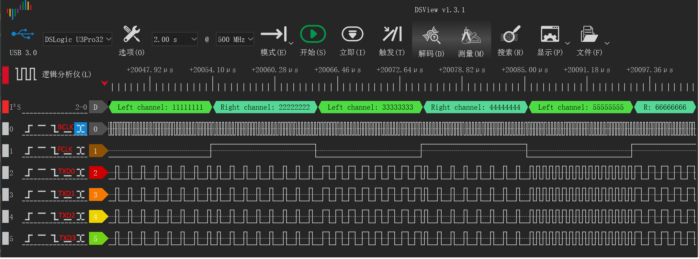

# I2S多通道DMA传输示例

## 概述

- 该实例工程展示了使用I2S接口进行多通道DMA传输的功能

## 限制要求

- DMAv2外设支持burst小循环传输功能(如HPM6E00系列)
- 由于是将数据源依次写入I2S->TXD[0 - 3]寄存器中， 所以数据源格式要求是32bit数据位宽按照line0， line1， line2，line3的顺序循环排列

## 工作原理

在I2S4通道发送模式下：
- I2S的多条Line共享相同的DMA请求
- 使用一个DMA通道，使用DMAv2的Burst小循环功能将数据源搬到多条I2S line对应的TXD寄存器中

## 运行要求

- 需要根据实际硬件配置I2S引脚，并使用逻辑分析仪等工具观察引脚波形

## 预期结果

程序运行后：
- 4个I2S通道将同时开始数据传输，可以观察引脚波形如下：

