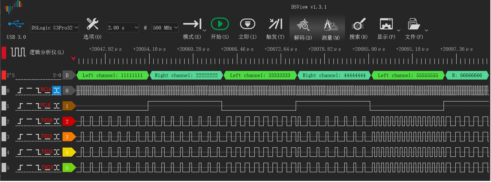

# I2S多通道中断传输示例

## 概述

- 该实例工程展示了使用I2S接口进行多通道中断传输的功能

## 限制要求

- 无

## 工作原理

在I2S4通道发送模式下：
- 设置I2S的FIFO产生中断请求
- 在中断处理函数中向多个I2S Line的TXD寄存器中写入数据

## 运行要求

- 需要根据实际硬件配置I2S引脚，并使用逻辑分析仪等工具观察引脚波形

## 预期结果

程序运行后：
- 4个I2S通道将同时开始数据传输，可以观察引脚波形如下：

